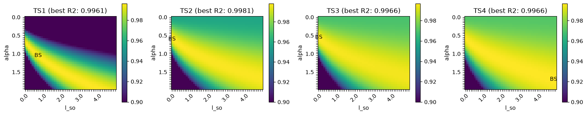
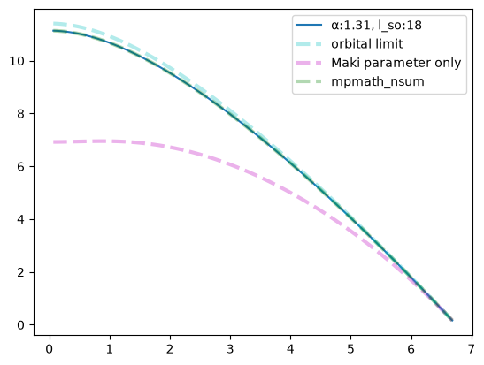

# WHH model fitting
> English and some code revised/refactored by Claude Opus 4.8 (2026).  

***Dirty Limit Only***  
To fit the WHH model[1] to the data taken at [QMEP Lab, ChangWon National University, Korea](https://sites.google.com/gs.cwnu.ac.kr/qmep), I implemented the `WHHModel` and tested it on Kim et al.'s data using `scipy.optimize.least_squares`. For the RHS, `mpmath.nsum` and `polygamma closed form` are compared. Both methods were consistent with residual less than 1e-12 and `polygamma form` was about $200\times$ faster.   
   
***Figure from [whh_model.ipynb](whh_model.ipynb)***  
Data points digitized from Figure S9 and Table S1 of Kim et al. (2025) [2]  


Note that `TS4` terminated on the *ftol* condition with its Maki parameter $\alpha$ pinned at the upper bound, because the R2 surface over the $(\alpha, \lambda_{SO})$ plane has a broad valley with only a small drop in R2.  

***R2 score heatmap: The broad valley of $(\alpha, \lambda_{SO})$***
* Colorscale minimum: 0.90. 
* BS: parameter pair with best R2 score.




## Equation
The WHH model describes the $H_{c2}$ versus $T$ relation of conventional, type-II superconductors.  
Using Kim et al. (2025)'s equation on page 6 with a correction.[2]  

$$\ln\frac{1}{t}=\sum^\infty_{\nu=-\infty}\left(\frac{1}{|2\nu+1|}-\left[|2\nu+1|+\frac{\bar{h}}{t}+\frac{(\frac{\alpha\bar{h}}{t})^2}{|2\nu+1|+\frac{\bar{h}+\lambda_{SO}}{t}}\right]^{-1}\right)$$

 where $\bar{h} = (4/\pi^2)[H_{c2}/(T_c\cdot|dH_{c2}(T)/dT|_{T_c})]$ and $t=T/T_c$.
    
### Polygamma closed form
Optionally, You can use `mpmath.nsum` with `methods="r+s+e"` (see usage).  
By default, I used the digamma $\Psi$ and trigamma $\Psi^{(1)}$ functions for the summation.  

$$\textrm{RHS} = \left(\frac{1}{2}+\frac{\lambda_{SO}}{4tq}\right)\Psi\left(\frac{1-q}{2}+\frac{\bar{h}+\lambda_{SO}/2}{2t}\right)+\left(\frac{1}{2}-\frac{\lambda_{SO}}{4tq}\right)\Psi\left(\frac{1+q}{2}+\frac{\bar{h}+\lambda_{SO}/2}{2t}\right)-\Psi(\frac{1}{2})$$

where $q = \frac{\sqrt{\lambda_{SO}^2/4-\left(\alpha \bar{h}\right)^2}}{t}$.  
On the seam ($\lambda_{SO} \sim 2\alpha \bar{h}$):  

$$\textrm{RHS on seam} = \Psi\left(\frac{1}{2}+\frac{\bar{h}+\lambda_{SO}/2}{2t}\right)-\Psi\left(\frac{1}{2}\right)-\frac{\lambda_{SO}}{4t}\Psi^{(1)}\left(\frac{1}{2}+\frac{\bar{h}+\lambda_{SO}/2}{2t}\right)$$


## Module and notebooks
* [whh_model.ipynb](whh_model.ipynb)
    * Description of the 'polygamma closed form'
    * Preview the curves
    * Example fit to Kim et al. (2025) data
* [series_consistency.ipynb](series_consistency.ipynb)
    * Comparison with `mpmath.nsum`
    * For the summation of the series, I first tried `mpmath.nsum`. With argument `method='r+s+e'`, it was accurate but too slow. So, I implemented this polygamma closed form.
* [whh.py](whh.py)
    * Implemented the `WHHModel` class for fitting and curve plotting.

## Usage
***Curve Plot***  
```python
import numpy as np
import matplotlib.pyplot as plt

from whh import WHHModel
# values from Mayoh et al. (2017) [3]
slope=2.44
t_c=6.75
alpha=1.31
l_so=18

# initialize models
m = WHHModel(slope=slope, t_c=t_c, alpha=alpha, l_so=l_so)
m_orbital = WHHModel(slope=slope, t_c=t_c, alpha=0, l_so=0) # orbital limit at zero T
m_l0 = WHHModel(slope=slope, t_c=t_c, alpha=alpha, l_so=0) # without spin-orbit scattering
# model using `mpmath.nsum` (method='r+s+e')
m_nsum = WHHModel(slope=slope, t_c=t_c, alpha=alpha, l_so=l_so, summation='mpmath_nsum')

# temperature from 0.01Tc to 0.99Tc.
n=99
t_grid = np.linspace(0.01, 0.99, n) 

# curve with reference lines including mpmath.nsum
_, h = m.curve(t_grid, return_reduced=False)
_, h_orb = m_orbital.curve(t_grid, return_reduced=False)
_, h_l0 = m_l0.curve(t_grid, return_reduced=False)
_, h_nsum = m_nsum.curve(t_grid, return_reduced=False) # mpmath:nsum, >100 times slower

plt.plot(t_grid*t_c, h, label=f"α:{alpha}, l_so:{l_so}")
plt.plot(t_grid*t_c, h_orb, 'c--', label="orbital limit", linewidth=3, alpha=0.3)
plt.plot(t_grid*t_c, h_l0, 'm--', label="Maki parameter only", linewidth=3, alpha=0.3)
plt.plot(t_grid*t_c, h_nsum, 'g--', label="mpmath_nsum", linewidth=3, alpha=0.3) # (mpmath:nsum)
plt.legend()
plt.show()
```


***Fitting***
```python
import numpy as np
from scipy.optimize import least_squares
import pandas as pd

from whh import WHHModel

# kim et al. (2025) figure S9, Table S1 data
data_df = pd.read_csv("kim_data.csv")
meta_df = pd.read_csv("kim_meta.csv", index_col='exp_name')
experiments = meta_df.index.tolist()
data_df=data_df.rename(columns={'T(K)':'T','Hc2(T)':'field'})

fit = ["alpha", "l_so"] # parameters to fit
fixed = ['slope', 't_c']
misc_from_csv = ['h_orb',]

# series summation by polygamma function (new default)
results=[]

for ei in experiments:
    measured_df = data_df[data_df['exp_name']==ei]
    T_obs = measured_df['T'] # temperature
    h_obs = measured_df['field'] # field
    fixed_params = meta_df[fixed].loc[ei].to_dict()
    misc_params = meta_df[misc_from_csv].loc[ei].to_dict()
    
    model = WHHModel(**fixed_params)
    resid, x0 = model.make_residual(T_obs, h_obs, fit=fit)
    
    res=least_squares(resid, x0, bounds=((0, 0), (5, 100)), xtol=1e-12, gtol=1e-12)
    results.append(dict(
        exp_id=ei,
        alpha = res.x[0],
        l_so = res.x[1],
        cost = res.cost,
        status = res.status,
        **misc_params,
        **fixed_params
        ))
pg_df = pd.DataFrame.from_dict(results)
pg_df
```

|exp_id|alpha|l_so|cost|status|h_orb|slope|t_c|
|---|----|----|----|----|----|---|---|
|TS1|0.767779|1.337883e-01|0.001097|2|5.22|-1.4|5.4|
|TS2|0.578303|4.110000e-20|0.000290|2|5.31|-1.4|5.5|
|TS3|0.582207|2.523624e-15|0.000894|2|4.94|-1.4|5.1|
|TS4|5.000000|5.000042e+01|0.000720|2|4.83|-1.4|5.0|

(TS4: converged to a bound; see the note above)

## References
[1] Werthamer, N. R., Helfand, E. & Hohenberg, P. C. Temperature and Purity Dependence of the Superconducting Critical Field, H c 2 . III. Electron Spin and Spin-Orbit Effects. Phys. Rev. 147, 295–302 (1966). https://doi.org/10.1103/PhysRev.147.295  
[2] Kim, S. et al. Spin-orbit coupling induced enhancement of upper critical field in superconducting A15 single crystals. Journal of Alloys and Compounds 1037, 182350 (2025). https://doi.org/10.1016/j.jallcom.2025.182350  
[3] Mayoh, D. A., Barker, J. A. T., Singh, R. P., Balakrishnan, G., Paul, D. McK., & Lees, M. R. (2017). Superconducting and normal-state properties of the noncentrosymmetric superconductor Re 6 Zr. Physical Review B, 96(6), 064521. https://doi.org/10.1103/PhysRevB.96.064521