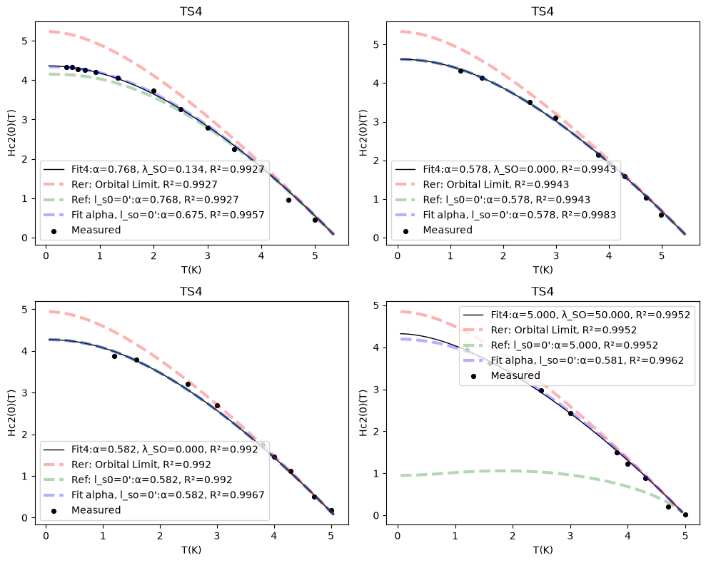

# WHH model fitting

(Dirty limit, single-band) Using Kim et al.(2025)'s equation on page 6 with a correction.[1]  
I fit the WHH model to the data taken by [MJ(graduate student)](https://sites.google.com/gs.cwnu.ac.kr/qmep/members/members?authuser=0#h.c06n2cg4biui) at [QMEP Lab, ChangWon National University, Korea](https://sites.google.com/gs.cwnu.ac.kr/qmep).  

* [whh_model.ipynb](whh_model.ipynb)
    * Description of the 'polygamma closed form'
    * Preview the curves
    * Example fit to Kim et al. (2025) data
* [series_consistency.ipynb](series_consistency.ipynb)
    * Comparison with `mpmath.nsum`
    * `mpmath.nsum` with `method='r+s+e'` was accurate but too slow.
* [whh.py](whh.py)
    * Implemented `WHHModel` class for fitting and curve plotting.

## Fit
Data points digitized from Figure S9 and Table S1 of Kim et al. (2025), Ref. [1]  

  
## Equation
  
$$\ln\frac{1}{t}=\sum^\infty_{\nu=-\infty}\{\frac{1}{|2\nu+1|}-[|2\nu+1|+\frac{\bar{h}}{t}+\frac{(\frac{\alpha \bar{h}}{t})^2}{|2\nu+1|+\frac{\bar{h}+\lambda_{SO}}{t}}]^{-1}\}$$
  
* where $\bar{h} = (4/\pi^2)[H_{c2}/(T_c\cdot|dH_{c2}(T)/dT|_{T_c})]$  
* $t=T/T_c$

### Polygamma closed form
Used for the summation of the series $\sum_{\nu=-\infty}^\infty\{...\}$.  

$$\textrm{RHS} = \left(\frac{1}{2}+\frac{\lambda_{SO}}{4tq}\right)\Psi\left(\frac{1-q}{2}+\frac{\bar{h}+\lambda_{SO}/2}{2t}\right)+\left(\frac{1}{2}-\frac{\lambda_{SO}}{4tq}\right)\Psi\left(\frac{1+q}{2}+\frac{\bar{h}+\lambda_{SO}/2}{2t}\right)-\Psi(\frac{1}{2})$$

where $q = \frac{\sqrt{\lambda_{SO}^2/4-\left(\alpha \bar{h}\right)^2}}{t}$.  
On the seam($\lambda_{SO} \sim 2\alpha \bar{h}$):  

$$\textrm{RHS on seam} = \Psi\left(\frac{1}{2}+\frac{\bar{h}+\lambda_{SO}/2}{2t}\right)-\Psi\left(\frac{1}{2}\right)-\frac{\lambda_{SO}}{4t}\Psi^{(1)}\left(\frac{1}{2}+\frac{\bar{h}+\lambda_{SO}/2}{2t}\right)$$
  
where 

## References
[1]. Kim, S. et al. Spin-orbit coupling induced enhancement of upper critical field in superconducting A15 single crystals. Journal of Alloys and Compounds 1037, 182350 (2025).  
[2]. Werthamer, N. R., Helfand, E. & Hohenberg, P. C. Temperature and Purity Dependence of the Superconducting Critical Field, H c 2 . III. Electron Spin and Spin-Orbit Effects. Phys. Rev. 147, 295–302 (1966).
[3]. Mayoh, D. A., Barker, J. A. T., Singh, R. P., Balakrishnan, G., Paul, D. McK., & Lees, M. R. (2017). Superconducting and normal-state properties of the noncentrosymmetric superconductor Re 6 Zr. Physical Review B, 96(6), 064521. https://doi.org/10.1103/PhysRevB.96.064521